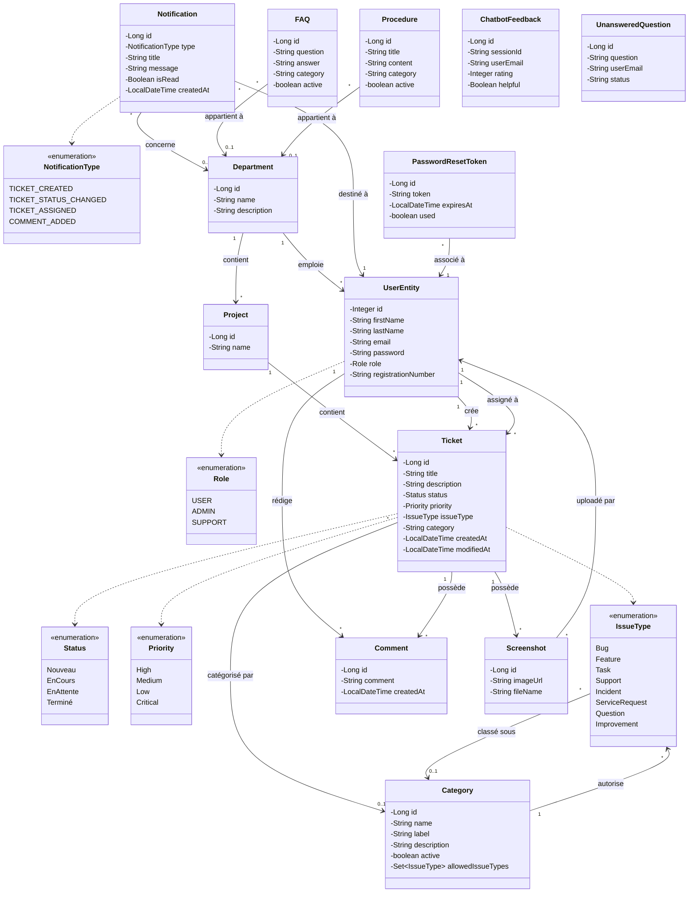

```mermaid
classDiagram
    direction TB

    %% ── Enums ──

    class Role {
        <<enumeration>>
        USER
        ADMIN
        SUPPORT
    }

    class Status {
        <<enumeration>>
        Nouveau
        EnCours
        EnAttente
        Terminé
    }

    class Priority {
        <<enumeration>>
        High
        Medium
        Low
        Critical
    }

    class IssueType {
        <<enumeration>>
        Bug
        Feature
        Task
        Support
        Incident
        ServiceRequest
        Question
        Improvement
    }

    class NotificationType {
        <<enumeration>>
        TICKET_CREATED
        TICKET_STATUS_CHANGED
        TICKET_ASSIGNED
        COMMENT_ADDED
    }

    %% ── Entités principales ──

    class UserEntity {
        -Integer id
        -String firstName
        -String lastName
        -String email
        -String password
        -Role role
        -String registrationNumber
    }

    class Department {
        -Long id
        -String name
        -String description
    }

    class Project {
        -Long id
        -String name
    }

    class Ticket {
        -Long id
        -String title
        -String description
        -Status status
        -Priority priority
        -IssueType issueType
        -String category
        -LocalDateTime createdAt
        -LocalDateTime modifiedAt
    }

    class Comment {
        -Long id
        -String comment
        -LocalDateTime createdAt
    }

    class Screenshot {
        -Long id
        -String imageUrl
        -String fileName
    }

    class Category {
        -Long id
        -String name
        -String label
        -String description
        -boolean active
        -Set~IssueType~ allowedIssueTypes
    }

    class Notification {
        -Long id
        -NotificationType type
        -String title
        -String message
        -Boolean isRead
        -LocalDateTime createdAt
    }

    class FAQ {
        -Long id
        -String question
        -String answer
        -String category
        -boolean active
    }

    class Procedure {
        -Long id
        -String title
        -String content
        -String category
        -boolean active
    }

    class PasswordResetToken {
        -Long id
        -String token
        -LocalDateTime expiresAt
        -boolean used
    }

    class ChatbotFeedback {
        -Long id
        -String sessionId
        -String userEmail
        -Integer rating
        -Boolean helpful
    }

    class UnansweredQuestion {
        -Long id
        -String question
        -String userEmail
        -String status
    }

    %% ── Relations ──

    Department "1" --> "*" Project : contient
    Department "1" --> "*" UserEntity : emploie
    Project "1" --> "*" Ticket : contient
    UserEntity "1" --> "*" Ticket : crée
    UserEntity "1" --> "*" Ticket : assigné à
    UserEntity "1" --> "*" Comment : rédige
    Ticket "1" --> "*" Comment : possède
    Ticket "1" --> "*" Screenshot : possède
    Ticket "*" --> "0..1" Category : catégorisé par
    Notification "*" --> "1" UserEntity : destiné à
    Notification "*" --> "0..1" Department : concerne
    FAQ "*" --> "0..1" Department : appartient à
    Procedure "*" --> "0..1" Department : appartient à
    PasswordResetToken "*" --> "1" UserEntity : associé à
    Screenshot "*" --> "1" UserEntity : uploadé par

    %% ── Relation Category <-> IssueType ──
    Category "1" --> "*" IssueType : autorise
    IssueType "*" --> "0..1" Category : classé sous

    %% ── Enums utilisés ──

    UserEntity ..> Role
    Ticket ..> Status
    Ticket ..> Priority
    Ticket ..> IssueType
    Notification ..> NotificationType
```